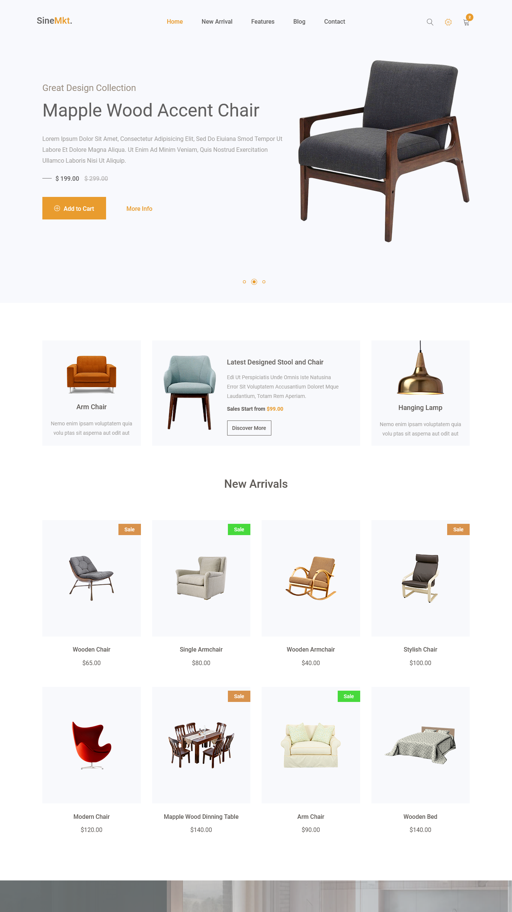
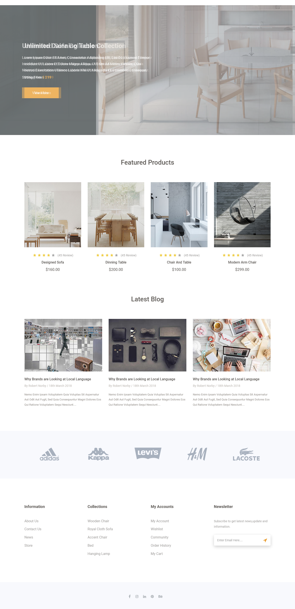

  
  
  
  

   
   

  <h2 align="center">Frun - Single page Ecommerce Website Design</h2>

Frun is a fully responsive Single page Ecommerce website,  Responsive for all devices, build using HTML, CSS, and JavaScript.

<a href="https://frun-ecommerce.netlify.app/"><strong>➥ Live Demo</strong></a>

 

### Demo Screeshots

##  Connect with Me

    
